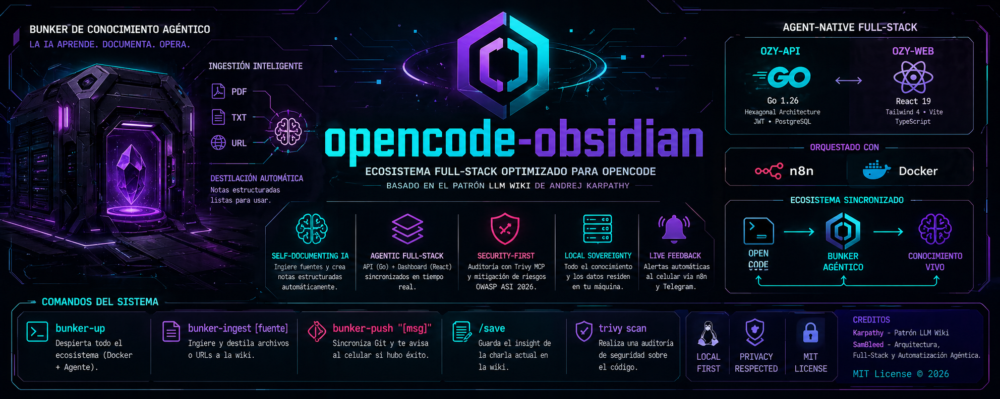

# 🏛️ opencode-obsidian (Bunker OS)

<p align="center">
  
</p>

[](LICENSE)
[](PROJECT.md)
[](Makefile)
[](.github/workflows/test.yml)
[](automation/n8n-lab)
[](https://opencode.ai)
[](https://obsidian.md)

**Bunker OS** is a local-first knowledge operating system built on Obsidian. It turns AI sessions, research, audits, evidence, and decisions into persistent operational assets. Automation via n8n, text retrieval via BM25, and a full orchestration pipeline for OpenCode.

Based on the [LLM Wiki pattern](https://gist.github.com/karpathy/442a6bf555914893e9891c11519de94f) by Andrej Karpathy, forked from [claude-obsidian](https://github.com/AgriciDaniel/claude-obsidian), independently evolved into an operations-first automation system.

---

## Table of Contents

- [Why Bunker OS?](#-why-bunker-os)
- [Features](#-key-features)
- [vs claude-obsidian](#-vs-claude-obsidian)
- [Quick Start](#-quick-start)
- [Commands](#-commands)
- [Skills](#-skills)
- [n8n Automation](#-n8n-automation)
- [Architecture](#-architecture)
- [BM25 Text Retrieval](#-bm25-text-retrieval)
- [Testing](#-testing)
- [Repository Structure](#-repository-structure)
- [FAQ](#-faq)
- [Requirements](#-requirements)
- [Contributing](#-contributing)
- [License](#-license)

---

## ✨ Why Bunker OS?

| Capability | Bunker OS | claude-obsidian | Smart Connections |
|------------|-----------|-----------------|-------------------|
| **Self-organizing wiki** | ✅ Creates entities, concepts, sources | ✅ | ❌ |
| **n8n automation** | ✅ Async pipelines + webhooks + DLQ | ❌ | ❌ |
| **Autoresearch** | ✅ 3-round web with gap-filling | ✅ | ❌ |
| **Text retrieval** | ✅ BM25 (zero deps, stdlib only) | ✅ BM25 + API | ❌ |
| **Thinking framework** | ✅ 10 principles | ✅ | ❌ |
| **Tests + CI** | ✅ 430 tests, GitHub Actions | ✅ | ❌ |
| **Dead Letter Queue** | ✅ Global error handler | ❌ | ❌ |
| **Evidence vault** | ✅ SHA256 checksums | ❌ | ❌ |
| **Multi-channel alerts** | ✅ Slack / Telegram / Discord | ❌ | ❌ |
| **Health monitoring** | ✅ Active n8n workflow | ❌ | ❌ |
| **Multi-methodology** | ❌ (generic only) | ✅ LYT/PARA/Zettelkasten | ❌ |
| **Multi-writer safe** | ❌ (single-writer) | ✅ Per-file locks | ❌ |
| **Open source** | ✅ MIT | ✅ MIT | ⚠️ Freemium |

> Bunker OS does not compete with claude-obsidian — it **complements** it. Where claude-obsidian is a researcher, Bunker OS is an operator. Both can coexist pointing at the same vault.

---

## 🚀 Key Features

### 🧠 Knowledge
- **Persistent wiki**: 200+ pages of concepts, entities, sources, blueprints, and projects
- **Autoresearch**: 3-round autonomous web research. Decomposes topics, searches, cross-references sources, and files everything into the wiki
- **BM25 Text Retrieval**: Fast keyword search over 200+ wiki pages. Pure Python, zero external dependencies, no LLM needed for indexing. OpenCode reads results and synthesizes answers
- **/think**: 10-principle decision framework for architectural decisions and audits
- **Wiki-ingest**: Source ingestion with automatic entity and concept extraction
- **Wiki-lint**: Health check with 8 categories (orphans, dead links, missing frontmatter)

### 🤖 n8n Automation
- **AOC v4 Enterprise**: Pipeline: webhook → AI triage (OpenRouter) → GitHub issues → multi-channel notifications
- **Dead Letter Queue**: Global error trigger that catches errors from ALL workflows
- **Health Check**: Active workflow monitoring system status every 5 min
- **Ultimate Alerter**: Multi-channel alerts (Slack / Telegram / Discord)
- **Emergency Reprocessor**: Auto-retry of failed events every 5 min

### 🛡️ Operations
- **430 tests**: 5 suites, Makefile, GitHub Actions CI on every push/PR
- **Evidence Vault**: report.zip and security-audit-report.json indexed with SHA256
- **Integrity Engine**: Automated vault health scripts with Markdown + JSON reports
- **Command Center**: Dashboard + agent queue + handovers + governance
- **OpenCode hooks**: SessionStart (reads hot.md), PostCompact (reloads after compaction), Stop (auto-update hot.md)
- **13 OpenCode skills** ready to use

---

## 🆚 vs claude-obsidian

| Dimension | Bunker OS | claude-obsidian |
|-----------|-----------|-----------------|
| **Version** | v1.3.1 | v1.9.2 |
| **Purpose** | Operations + automation + security | PKM / second brain |
| **Harness** | OpenCode | Claude Code (official plugin) |
| **Language** | English | English |
| **Skills** | 13 operational | 15 research |
| **Async automation** | ✅ n8n on Docker | ❌ None |
| **Text Retrieval** | ✅ BM25 (delegates to agent) | ✅ BM25 + Anthropic API + rerank |
| **Tests** | 430 (5 suites) | ~1,240 (9 suites) |
| **Evidence with checksums** | ✅ | ❌ |
| **Dead Letter Queue** | ✅ | ❌ |
| **Multi-channel alerts** | ✅ Slack/TG/Discord | ❌ |
| **Multi-methodology** | ❌ | ✅ LYT/PARA/Zettelkasten |
| **Multi-writer safe** | ❌ | ✅ |
| **Plugin marketplace** | ❌ | ✅ Claude Code plugin |
| **Stars** | - | 8.5k ⭐ |

---

## ⚡ Quick Start

### Option 1: Clone as vault (recommended)

```bash
git clone https://github.com/SamBleed/opencode-obsidian.git
cd opencode-obsidian
```

Open the folder in **Obsidian**: Manage Vaults → Open folder as vault → select `opencode-obsidian/`.

Open **OpenCode** in the same folder. Start with `/autoresearch` or `ingest [file]`.

### Option 2: Reference from another project

Add to your `AGENTS.md`:

```markdown
## Wiki Knowledge Base
Path: /path/to/opencode-obsidian

When you need context:
1. Read wiki/hot.md first (recent context)
2. If not enough, read wiki/index.md
3. Only then read individual wiki pages
```

---

## 🎮 Commands

### OpenCode Skills

| Command | Action |
|---------|--------|
| `/autoresearch [topic]` | 3-round autonomous web research. Decomposes, searches, cross-references, files to wiki |
| `/retrieve [query]` | BM25 text search over wiki (no LLM needed for indexing) |
| `/think [problem]` | 10-principle decision framework for architectural decisions |
| `ingest [file]` | Ingest source: extract entities and concepts, create/update pages |
| `ingest all of these` | Batch ingestion with parallel processing |
| `what do you know about X?` | Query the wiki: reads hot → index → pages → synthesizes with citations |
| `lint the wiki` | Health check: orphans, dead links, gaps, stale claims |
| `save this` | Save current conversation as a wiki note |
| `/canvas` | Open or create visual canvas |
| `/canvas add image [path]` | Add image to canvas |

### CLI Scripts

```bash
make test                              # 430 tests, 5 suites
./bin/bunker-check.sh                  # Local definition of done
./bin/wiki-integrity.sh                # Scan for orphans and broken links
./bin/evidence-index.sh                # Index evidence with SHA256
./bin/bunker.sh init                   # Vault health check
./bin/wiki-sync.sh --apply             # Sync + commit wiki
python3 scripts/retrieve.py build      # Rebuild BM25 index
python3 scripts/retrieve.py "query"    # BM25 text retrieval
```

### /autoresearch: autonomous research loop

Configurable at `skills/autoresearch/references/program.md`:

- Max rounds: 3
- Max pages per session: 15
- Source preference (academic, official, news)
- Confidence scoring (high/medium/low)
- Domain-specific rules

The loop:

1. **Round 1, broad search**: decompose into 3-5 angles, 2-3 queries each via Exa, fetch top results via webfetch
2. **Round 2, gap fill**: targeted searches for contradictions and missing pieces
3. **Round 3, synthesis**: one more pass if gaps remain. Then file to wiki

URL validation + content sanitization: rejects `file://`/`javascript://`/RFC1918, escapes `[[` in external sources, truncates to 50KB.

### /think: 10-principle decision framework

```
/think <problem statement>
```

Walks through 10 stages: OBSERVE (external) → OBSERVE (internal) → LISTEN → THINK → CONNECT (lateral) → CONNECT (system) → FEEL → ACCEPT → CREATE → GROW

Use for non-trivial architectural decisions, audits, post-mortems.

---

## 🧠 Skills (13 repo + 6 ECC global)

### Bundled in this repo

| Skill | Description |
|-------|-------------|
| `autoresearch` | 3-round web research with Exa + webfetch |
| `wiki-retrieve` | BM25 text retrieval (stdlib Python, no deps) |
| `think` | 10-principle decision framework |
| `wiki-ingest` | Ingest sources into the wiki |
| `wiki-query` | Query the wiki with synthesis |
| `wiki-lint` | Vault health check |
| `save` | Save conversation as wiki note |
| `wiki` | Wiki orchestrator (setup, scaffold, routing) |
| `canvas` | Obsidian canvas visual layer |
| `defuddle` | Web extraction wrapper |
| `evidence-index` | Evidence indexing with SHA256 |
| `obsidian-bases` | Obsidian Bases schema reference |
| `obsidian-markdown` | Obsidian Flavored Markdown reference |

### Provided by ECC global config (~/.config/opencode/skills/)

These skills are not bundled in the repo but are available when the ECC skill bundle is installed:

| Skill | Description |
|-------|-------------|
| `code-review` | Code quality review |
| `security-review` | OWASP security review |
| `infra-design` | Infrastructure design |
| `tdd-workflow` | TDD with red-green-refactor |
| `verification-loop` | Build + test + lint + security pre-PR |
| `work-unit-commits` | Commits organized by work unit |

---

## 🤖 n8n Automation

n8n is the Bunker's async "nervous system." It runs on Docker and exposes an MCP bridge for OpenCode.

### Available Workflows

| Workflow | Nodes | Status | Description |
|----------|-------|--------|-------------|
| **Health Check** | 2 | 🟢 **Active** | System health check every 5 min |
| **Ultimate Alerter** | 2 | 🟢 **Active** | Multi-channel alert via webhook |
| **Dead Letter Queue** | 5 | ⚪ Inactive | Error trigger: captures all workflow errors |
| **AOC v4 Enterprise** | 37 | ⚪ Inactive | Pipeline: webhook → AI triage → GitHub → notifications |

### AOC v4 Enterprise Pipeline

```
Webhook → Ingress Guard → IF Valid
  ├── Invalid → Rejected Response
  └── Valid → Redis Idempotency → IF Replay
       ├── Replay → Cached Response
       └── New → AI Triage (OpenRouter)
            → Parse AI Decision → IF Create?
                 ├── Create → GitHub Issue
                 ├── Review → Issue HITL
                 ├── Emergency → Emergency Queue
                 └── Duplicate → (skip)
                              ↓
                         Build Notification
                              ↓
                    IF Slack? → Slack / Skip
                         → IF Telegram? → TG / Skip
                         → IF Discord? → DC / Skip
                              ↓
                         Write Audit → Final Status
```

### Dead Letter Queue

```
Error Trigger (global) → Normalize Error → IF Critical?
  ├── CRITICAL → Notify (placeholder) → Store in DLQ
  └── WARNING  → Store in DLQ
```

Catches errors from **any** workflow in the instance. Classifies severity (CRITICAL for auth/permissions/timeout). Persists last 200 errors in staticData.

### Infrastructure

```yaml
# docker-compose tuning
N8N_CONCURRENCY_PRODUCTION_LIMIT=10   # Prevent OOM on spikes
EXECUTIONS_DATA_PRUNE=true            # Auto cleanup
N8N_METRICS=true                      # Observability
N8N_LOG_FORMAT=json                   # Structured logs
```

Environment: `POSTGRES recommended`, `queue` mode with Redis for horizontal scaling.

---

## 🏗️ Architecture

### Vault flow

```
.raw/ (immutable sources)
  │
  ▼
wiki-ingest (OpenCode skill)
  │  Extracts entities, concepts, sources
  │  Creates/updates pages, cross-references
  ▼
wiki/ (persistent knowledge)
  ├── hot.md    → recent context (~500 words)
  ├── index.md  → master catalog
  ├── log.md    → append-only operation log
  ├── sources/  → source summaries
  ├── entities/ → people, orgs, products
  ├── concepts/ → ideas, patterns, frameworks
  ├── meta/     → dashboard, handovers, evidence
  └── ...       → comparisons, questions, projects
```

### BM25 text retrieval

```
query → scripts/retrieve.py "text"
  │
  └─ BM25 index (wiki pages chunked ~500 tokens)
       │
       ▼
  ranked results with: path, score, preview
       │
       ▼
  OpenCode reads and synthesizes
```

### Async automation

```
OpenCode (skills)
  │  n8n-mcp bridge
  ▼
n8n Docker (localhost:5678)
  │
  ├── Webhooks → AOC pipeline → GitHub Issues
  ├── Schedule → Health Check (5 min)
  ├── Schedule → Emergency Reprocessor (5 min)
  └── Error Trigger → Dead Letter Queue
       │
       ▼
  Slack / Telegram / Discord (notifications)
```

---

## 🔍 BM25 Text Retrieval

The Bunker includes a fast, zero-dependency text retrieval system using BM25 — the same ranking algorithm behind Elasticsearch. No embeddings, no LLM calls, no external services.

OpenCode (the agent) receives the ranked chunks and applies its own model to understand and synthesize the answer. **The agent is the only intelligence in the loop.**

### Pipeline

```
query → BM25 (wiki page chunks) → top 5 results → OpenCode reads & synthesizes
```

### Performance

- **8 pages** indexed (seed vault — grows with usage)
- **~500 token chunks** at paragraph boundaries
- **Pure Python stdlib** — no numpy, no ollama, no API keys

### Maintenance

```bash
# Build/update index
python3 scripts/retrieve.py build

# Check status
python3 scripts/retrieve.py status

# Search
python3 scripts/retrieve.py "n8n docker automation" --top 5
```

---

## 🧪 Testing

### Suites

| Suite | Tests | What it validates |
|-------|-------|-------------------|
| `test-workflows` | 344 | All n8n JSONs parseable, valid connections, no orphan nodes |
| `test-wiki` | 21 | Essential files exist, valid frontmatter, docker running |
| `test-scripts` | 61 | Bash syntax, shebang, executables, no hardcoded secrets, go vet |
| `test-yaml` | 2 | CI and docker-compose YAML valid |
| `test-retrieve` | 2 | BM25 index exists, search returns results |

### CI

```yaml
# .github/workflows/test.yml
on: push/PR to main → 5 suites → Python + Go + bash
```

```bash
make test    # 430 tests, 5 suites
```

### Secrets scanned

The test suite automatically checks for:
- OpenAI keys (`sk-...`)
- GitHub PAT (`ghp_...`, `gho_...`)
- AWS keys (`AKIA...`)
- Google API keys (`AIza...`)
- Slack tokens (`xox[baprs]-...`)

See [SECURITY.md](SECURITY.md) for the full security policy.

---

## 📁 Repository Structure

```
opencode-obsidian/
├── skills/                       # 13 repo skills + 6 ECC global (v1.3.1)
│   ├── autoresearch/             # 3-round autonomous research
│   ├── wiki-retrieve/            # BM25 text retrieval
│   ├── think/                    # 10-principle framework
│   ├── wiki-ingest/              # Source ingestion
│   ├── wiki-query/               # Wiki querying
│   ├── wiki-lint/                # Vault health check
│   ├── save/                     # Save conversation
│   ├── wiki/                     # Wiki orchestrator
│   ├── canvas/                   # Visual canvas
│   ├── defuddle/                 # Web extraction
│   ├── evidence-index/           # Evidence indexing
│   ├── obsidian-bases/           # Bases schema
│   └── obsidian-markdown/        # OFM reference
├── agents/                       # 3 OpenCode agents
├── commands/                     # Slash commands
├── hooks/
│   └── hooks.json                # 7 hooks across 4 events
├── scripts/                      # Python + bash helpers
│   ├── bm25-index.py             # BM25 indexer
│   ├── retrieve.py               # Search orchestrator
│   └── ...
├── tests/                        # 5 suites, 430 tests
│   ├── test_workflow_connections.py
│   ├── test_wiki_integrity.sh
│   ├── test_scripts.sh
├── Makefile                       # 5 test targets (root)
├── bin/                          # 15 shell scripts + Go source + binary
│   ├── bunker-check.sh           # Full health check
│   ├── wiki-integrity.sh         # Integrity scan
│   ├── evidence-index.sh         # Evidence indexing
│   └── ... (15 more)
├── automation/
│   └── n8n-lab/                  # Docker + workflows
│       ├── docker-compose.yml
│       ├── .env
│       └── workflows/
├── wiki/                         # Obsidian vault (200+ pages)
│   ├── hot.md                    # Recent context
│   ├── index.md                  # Master catalog
│   ├── log.md                    # Operation log
│   ├── sources/                  # External sources
│   ├── entities/                 # People, orgs, products
│   ├── concepts/                 # Concepts and patterns
│   ├── meta/                     # Dashboard, handovers, evidence
│   ├── blueprints/               # Architecture blueprints
│   └── ...
├── .raw/                         # Immutable source documents
├── .github/workflows/test.yml    # CI: runs on push/PR
├── Makefile                      # 5 test targets
├── README.md                     # This file
├── PROJECT.md                    # Technical documentation
├── WIKI.md                       # Wiki schema reference
├── BUNKER_RULES.md               # Governance rules
├── AGENTS.md                     # Agent instructions
├── CONTRIBUTING.md               # Contribution guide
├── SECURITY.md                   # Security policy
└── CHANGELOG.md                  # Version history
```

---

## ❓ FAQ

**What's the difference between Bunker OS and claude-obsidian?**
Both projects share a common origin but diverged in purpose. claude-obsidian is a second brain for PKM/research. Bunker OS is an operations system with n8n automation, security, alerts, evidence, and a full remediation pipeline. They complement each other.

**Can I use Bunker OS without OpenCode?**
Technically yes (scripts are bash, tests are Makefile, n8n is Docker), but the real value is in the OpenCode skills. Without OpenCode you lose autoresearch, think, wiki-ingest, and wiki-query.

**Where is data stored?**
Everything is local. The vault is a folder of Markdown files on your disk. n8n runs on local Docker. No cloud data.

**How do I sync across devices?**
The vault is a plain folder of files. Use Obsidian Sync, Syncthing, iCloud, Dropbox, or git.

**How do I add a source to the wiki?**
Drop the file in `.raw/` and say `ingest [filename]`. The skill extracts entities and concepts, creates pages, and updates indexes.

**What is the Dead Letter Queue?**
A global workflow that catches errors from any other n8n workflow. Classifies severity and persists to staticData for later review.

**How do I activate the AOC v4 Enterprise?**
Requires: OpenRouter API key, Discord webhook URL, and GitHub credentials in n8n. Configure env vars in `.env`, import the JSON in the n8n UI, and activate it.

**How do I rebuild the BM25 index after adding pages?**
```bash
python3 scripts/retrieve.py build
```

**Where are the tests?**
```bash
make test    # 430 tests
```

---

## 📋 Requirements

| Component | Minimum | Notes |
|-----------|---------|-------|
| OpenCode | latest | https://opencode.ai |
| Obsidian | v1.6+ | Any modern version |
| Python | 3.10+ | For BM25 index + retrieve |
| Bash | 4.0+ (or zsh) | For operational scripts |
| Docker | latest | For n8n |
| Git | any | For vault versioning |

**Optional:**
- **ollama** (optional, for local inference via OpenCode if configured)
- **n8n** on Docker (for workflow automation)
- **OpenRouter API key** (for AI triage in AOC v4)

---

## 🤝 Contributing

PRs welcome. Read first:

- [`PROJECT.md`](PROJECT.md): technical documentation
- [`BUNKER_RULES.md`](BUNKER_RULES.md): governance and standards
- [`CHANGELOG.md`](CHANGELOG.md): version history

```bash
make test    # Run tests before pushing
```

---

## 📜 License

MIT License. See [LICENSE](LICENSE) for full text. Free for personal and commercial use.

---

<p align="center">
  <i>Based on the <a href="https://gist.github.com/karpathy/442a6bf555914893e9891c11519de94f">LLM Wiki pattern</a> by Andrej Karpathy.</i>
  <br>
  <i>Built by <a href="https://github.com/SamBleed">SamBleed</a> for <a href="https://opencode.ai">OpenCode</a>.</i>
  <br>
  <i>Compounding knowledge is the highest-leverage habit a thinking person can build.</i>
</p>
