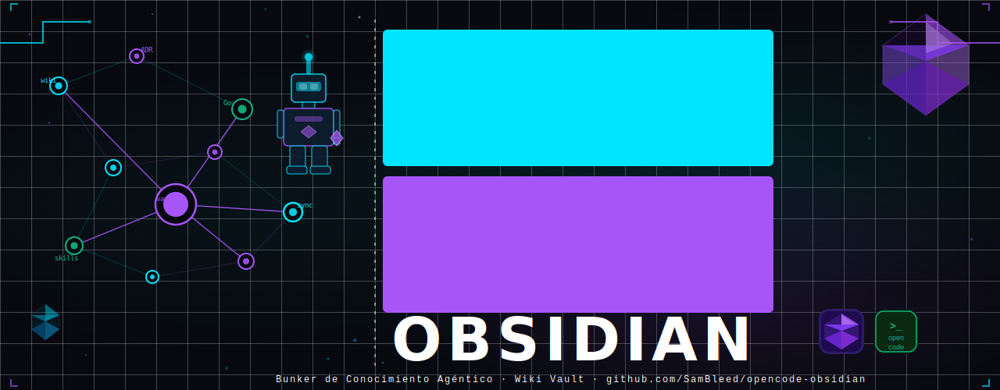

# opencode-obsidian

<p align="center">
  
</p>

[](https://github.com/SamBleed/opencode-obsidian/stargazers)
[](LICENSE)
[](https://opencode.ai)

**opencode-obsidian** es un Bunker de Conocimiento Agéntico y Ecosistema de Desarrollo Full-Stack optimizado para **OpenCode**. Basado en el patrón **LLM Wiki** de Andrej Karpathy, este sistema evoluciona y se autogestiona en cada sesión de pair-programming.

---

## 🚀 Características Principales

- **Agentic Ecosystem**: No es solo una wiki, es un entorno con API (Go) y Web (React) integrados.
- **Hard Detach**: Totalmente independiente de dependencias o nombres de Anthropic/Claude.
- **Compounding Knowledge**: La wiki "se vuelve más inteligente" con cada interacción y registro en DB.
- **Automated Security**: Auditoría nativa con **Trivy MCP** y **OWASP 2026** integrada.
- **Live Notifications**: Alertas automáticas al celular (Telegram) vía **n8n**.
- **Tech Stack 2026**: Go 1.26, React 19, Tailwind 4, PostgreSQL, Redis, Docker.

---

## 🏢 Ecosistema de Proyectos

El Bunker incluye una suite de aplicaciones "Agent-Native" en la carpeta `/projects`:

- **[OZY-API](projects/ozy-api/)**: Backend en Go 1.26. Arquitectura Hexagonal, JWT Auth, Logging JSON y PostgreSQL.
- **[OZY-WEB](projects/ozy-web/)**: Frontend en React 19 + Tailwind 4. Dashboard visual sincronizado con la API.

---

## 📦 Instalación y Control

### Un comando para despertarlos a todos:
```bash
# Levanta n8n Lab, abre el Bunker y lanza el Agente
bunker-up
```

### Sincronización Inteligente:
```bash
# Sincroniza Git y te avisa al celular si el push fue exitoso
bunker-push "feat: descripción de tu hito"
```

---

## 🛠️ Estructura del Bunker

```text
opencode-obsidian/
├── projects/        # Aplicaciones vivas (Go, React, DB)
├── wiki/            # Cerebro del proyecto (Markdown interconectado)
│   ├── blueprints/  # Fábrica de arquitecturas (Templates reales)
│   ├── concepts/    # Patrones técnicos y gobernanza
│   ├── entities/    # Registro de agentes y herramientas
│   └── decisions/   # ADRs (Architecture Decision Records)
├── bin/             # Power Scripts (bunker-up, bunker-push, bunker-alert)
├── docs/            # Manuales de Setup (N8N, MCP, etc.)
└── skills/          # Skills nativos para OpenCode
```

---

## 🤖 Comandos del Agente

| Comando | Descripción |
|---------|-----------|
| `bunker-up` | Arranca todo el ecosistema (Docker + Agente). |
| `bunker-push` | Sincroniza y notifica éxito vía n8n. |
| `query [topic]` | Busca conocimiento en la wiki y en la DB. |
| `/save` | Guarda el insight de la charla como nota permanente. |
| `trivy scan` | Realiza una auditoría de seguridad nativa (MCP). |

---

## 📜 Créditos

- [Karpathy](https://github.com/karpathy) - Patrón LLM Wiki original.
- **SamBleed** - Arquitectura Agéntica, Full-Stack integration y Automatización para OpenCode.

---

MIT License © 2026
