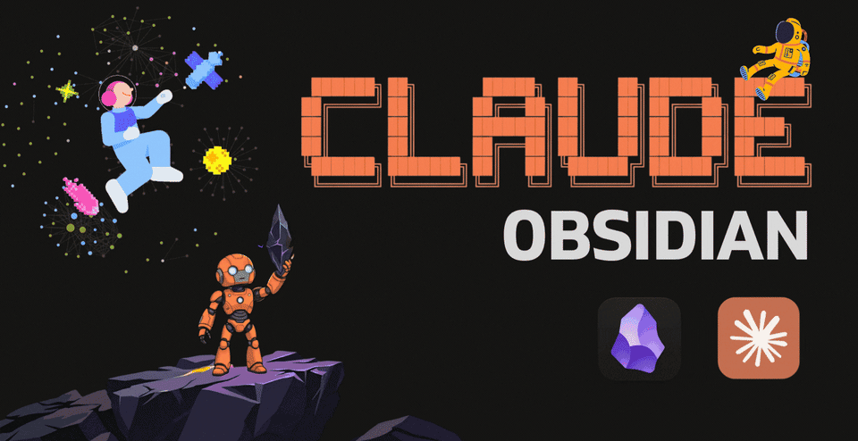

# opencode-obsidian

<p align="center">
  
</p>

[](https://github.com/SamBleed/opencode-obsidian/stargazers)
[](LICENSE)
[](https://opencode.ai)

**opencode-obsidian** es un Bunker de Conocimiento Agentico (Wiki Vault) optimizado para **OpenCode**, basado en el patrón **LLM Wiki** de Andrej Karpathy. Es un sistema persistente que evoluciona en cada sesión de pair-programming.

---

## 🚀 Características Principales

- **Hard Detach**: Totalmente independiente de dependencias o nombres de Anthropic/Claude.
- **Compounding Knowledge**: La wiki "se vuelve más inteligente" con cada interacción.
- **Agentic Infrastructure**: Incluye Blueprints de proyectos, ADRs y Protocolos de Handover.
- **Sync Automatizado**: Script integrado para sincronización con Git (`bin/wiki-sync.sh`).
- **Tech Stack 2026**: Guías de mejores prácticas para Go, React, Docker, Postgres y Redis.

---

## 📦 Instalación Rápida

```bash
# Un comando instala todo (Skills + Carpeta + Git)
bash <(curl -sL https://raw.githubusercontent.com/SamBleed/opencode-obsidian/main/bin/setup-opencode.sh)
```

---

## 🛠️ Estructura del Bunker

```text
opencode-obsidian/
├── .raw/           # Fuentes originales (PDFs, Logs, Research)
├── wiki/           # Cerebro del proyecto (Markdown interconectado)
│   ├── concepts/   # Patrones y docus técnicas
│   ├── entities/   # Personas, herramientas, librerías
│   ├── projects/   # Tracking de tus proyectos activos
│   └── decisions/  # ADRs (Architecture Decision Records)
├── bin/            # Scripts de automatización y sync
├── skills/         # Skills nativos para OpenCode
└── _templates/     # Templates para notas de Obsidian
```

---

## 🤖 Comandos del Agente

| Comando | Descripción |
|---------|-----------|
| `ingest [file]` | Procesa una fuente y crea notas vinculadas. |
| `query [topic]` | Busca conocimiento específico en el wiki. |
| `save this` | Guarda el insight de la charla como nota permanente. |
| `lint` | Health check: busca notas huérfanas y limpia el vault. |
| `/sync` | Ejecuta `bin/wiki-sync.sh` para guardar cambios. |

---

## 🔗 Protocolo AI (Cross-Project)

Para usar este conocimiento en otros repos, agrega esto al `AGENTS.md` de tu proyecto:

```markdown
## Wiki Knowledge Base
Path: ~/opencode-obsidian

Protocolo de lectura:
1. Leé wiki/hot.md (Contexto Activo)
2. Si no es suficiente, consultá wiki/index.md
3. Leé [[AI-PROTOCOL]] para más detalles.
```

---

## 📜 Créditos

- [Karpathy](https://github.com/karpathy) - Patrón LLM Wiki original.
- [AgriciDaniel](https://github.com/AgriciDaniel/claude-obsidian) - Base inicial del proyecto.
- **SamBleed** - Adaptación, Hard Detach y automatización para OpenCode.

---

MIT License © 2026
