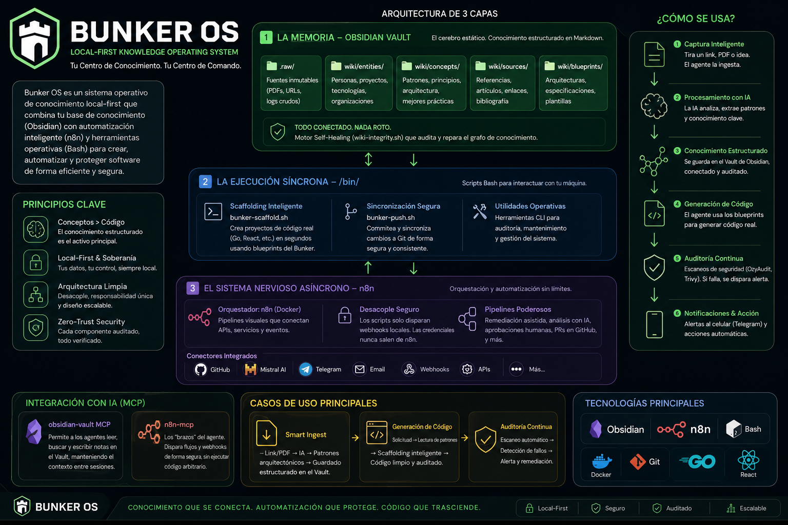

# 🏛️ opencode-obsidian (Bunker OS)

  

**opencode-obsidian** (Bunker OS) is a **local-first knowledge operating system** and OpenCode-oriented command center. It transforms AI sessions, research, audits, evidence, and decisions into persistent operational assets.

---

  

---

## 🚀 Key Features (Bunker v3.0)

- **Deep Capacity Wiki**: Core tech pillars expanded to senior patterns and reusable operational notes.
- **Async Automation Brain (n8n)**: Decouples API credentials, handles webhooks from scripts, and provides an MCP bridge for agentic execution.
- **Operational Scaffolding**: `bin/bunker-scaffold.sh` generates production-ready projects in seconds based on Bunker Blueprints.
- **Command Center**: `wiki/meta/dashboard.md` is the operational entry point.
- **Evidence Vault**: `report.zip` and `security-audit-report.json` are indexed with checksums, not edited in place.
- **Self-Healing Integrity**: `bin/wiki-integrity.sh` produces Markdown + JSON health reports.
- **Knowledge Supply Chain**: source-to-handover workflow, agent queue, and governance notes.

---

## 🛠️ Power Commands

| Command | Domain | Purpose |
|---------|--------|---------|
| `./bin/bunker-scaffold.sh` | **Ops** | Generate a new project using Bunker standards. |
| `./bin/wiki-integrity.sh` | **Hygiene** | Scan for orphan notes and broken links. |
| `./bin/bunker-check.sh` | **Health** | Run the local definition-of-done check. |
| `go run bin/ingest_server.go` | **Ingest** | Start the Smart Ingest Pipe locally. |
| `./bin/wiki-sync.sh --apply` | **Sync** | Commit reviewed knowledge changes. |

---

## ⚙️ Infrastructure & Grounding

- **9090**: Smart Ingest API.
- **NotebookLM**: research grounding.
- **Evidence index**: `wiki/meta/evidence-index.md`.
- **Agent queue**: `wiki/meta/agent-queue.md`.

---

## 📖 Live Documentation
- **[[overview]]**: High-level system summary.
- **[[BUNKER-OS.canvas]]**: Visual map of the entire architecture.
- **[[Security-Guardrails]]**: The Bunker's technical constitution.

---
MIT License © 2026 | **SamBleed** & **OpenCode Architect**
