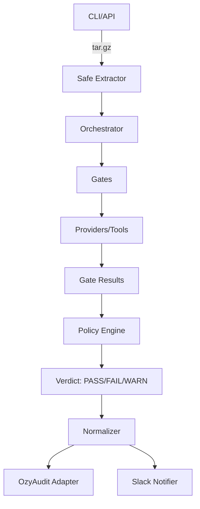

# OzyZT Architecture

The architecture of [[OzyZT]] is designed around the principles of **Modularity**, **Extensibility**, and **Zero-Trust Enforcement**. It separates the execution logic from the delivery interfaces.

## Layered Design

### 1. Core Engine (`engine/core/`)
Defines the fundamental contracts of the system:
- **Gate Protocol**: Common interface for all security checks.
- **Scoring Model**: Deterministic risk calculation (0-100).
- **Tool Checker**: Centralized availability detection for external binaries.

### 2. Execution Layer (`engine/execution/`)
The **Orchestrator** coordinates the pipeline:
- Supports **Sequential**, **Parallel**, and **Async** execution modes.
- Manages scan lifecycle and result aggregation.
- Includes a **Coverage Tracker** to identify skipped or reduced scans.

### 3. Security Gates (`engine/gates/`)
A collection of 7 gates, each using the **Provider Pattern**:
- **Gate**: High-level logic (e.g., "Scan Source Code").
- **Providers**: Specialized wrappers for tools (e.g., `TrivyProvider`, `SemgrepProvider`).
- This allows swapping or adding tools without modifying the core gate logic.

### 4. Policy Engine (`engine/policy/`)
Evaluates findings against user-defined rules:
- **Policy Packs**: Preset configurations (`default`, `strict`, `reduced-coverage`).
- **Waiver Manager**: Handles temporary "Accepted Risk" exceptions with expiration and ownership.
- **Enforcement**: Can elevate "Reduced Coverage" to "FAIL" in strict environments.

### 5. Normalization & Adapters (`engine/normalization/`, `engine/adapters/`)
Translates disparate tool outputs into a unified format:
- **NormalizedFinding**: Common schema for all vulnerabilities.
- **Adapters**: Connectors for external systems like [[OzyAudit]] and [[Slack]].

## Security Hardening
- **Path Sanitization**: Prevention of "Tar Bomb" / "Zip Slip" attacks during code upload.
- **Secret Masking**: All findings are automatically scanned for patterns to mask sensitive data before DB persistence.
- **Resource Limits**: Configurable upload size limits and per-gate timeouts.

## Data Flow

