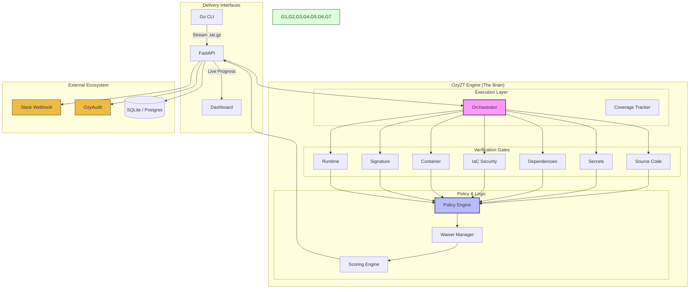

# OzyZT Visual Flow

This diagram visualizes the end-to-end journey of a code scan in the [[OzyZT]] platform.

## Functional Breakdown
1. **Ingestion**: The CLI packs code and sends it via HTTP streaming.
2. **Orchestration**: The engine decides the execution mode (Sequential/Parallel) and tracks tool availability.
3. **Evaluation**: Findings are filtered through the **Allowlist** and active **Waivers**.
4. **Conclusion**: A final **Security Score** is computed, and alerts are dispatched.
